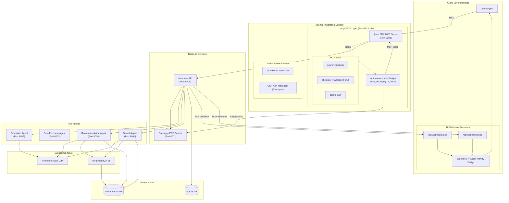

# VyapaarOS AI Blueprint: Retail Agentic Commerce

A next-generation reference implementation of the **Agentic Commerce Protocol (ACP)** and **Universal Commerce Protocol (UCP)**, engineered for intelligent merchant-controlled checkouts, autonomous multi-agent orchestration, and seamless real-world payments.

---

## What We Built: The Ultimate Agentic Commerce Experience

This project represents the bleeding edge of retail AI. We've built a fully autonomous, agent-driven commerce platform that seamlessly integrates intelligent product discovery, conversational recommendations, and secure real-world payments into a single, cohesive experience.

### Key Features & Technical Highlights

*   **Autonomous Apps SDK Widget (Vite + React)**: A lightning-fast, single-file micro-frontend injected into the client UI. It autonomously handles the entire shopping experience—from product discovery to payment—without requiring complex merchant-side UI development.
*   **Agentic Commerce Protocol (ACP) via MCP**: A FastAPI-based Model Context Protocol (MCP) server running on Port 2091. It exposes tools (`search-products`, `add-to-cart`, `checkout`, `get-recommendations`) directly to LLM agents, allowing the AI to orchestrate the entire shopping cart state dynamically.
*   **Universal Commerce Protocol (UCP) with Razorpay Integration**: We didn't just build a mock checkout—we integrated a full UCP-compliant delegated payment flow. The AI agents prepare the order, and the Apps SDK widget seamlessly hands off to the **Razorpay Payment Gateway** for secure, real-world transaction processing, before returning the cryptographically signed result back to the AI.
*   **Multi-Agent Architecture (NVIDIA NIM)**: Powered by local or cloud NVIDIA NIM models (`Nemotron-Nano-30B` & `NV-EmbedQA-E5`), the platform utilizes a swarm of specialized agents:
    *   **Search Agent**: Leverages Milvus Vector DB for semantic RAG product search.
    *   **Promotion Agent**: Dynamically applies discounts and orchestrates the checkout flow.
    *   **Recommendation Agent**: Understands user intent and cart context to suggest up-sells.
*   **Next.js Simulator UI**: A beautiful, real-time developer dashboard (`src/ui`) to visualize agent thinking, ACP communication, and UCP webhooks as they happen in milliseconds.

---

## Architecture



---

## Quick Start Guide

### Prerequisites
- Python 3.12+ & `uv` package manager
- Node.js 20.9+ & `pnpm`
- Docker 24+ and Docker Compose v2 (Required for Milvus Vector DB)
- VyapaarOS API key ([create one](https://build.nvidia.com/settings/api-keys))
- Razorpay API Keys (Optional, for live payments)

### 1. Clone and Configure
```bash
git clone https://github.com/VyapaarOS/Retail-Agentic-Commerce.git
cd Retail-Agentic-Commerce
cp env.example .env
```
Update `.env` with your API keys:
```env
VYAPAAR_LLM_API_KEY=nvapi-xxx
# Add Razorpay keys if testing live UCP payments
RAZORPAY_KEY_ID=rzp_test_xxx
RAZORPAY_KEY_SECRET=xxx
```

### 2. Start the Infrastructure (Docker)
The Search and Recommendation agents require the Milvus Vector Database to run.
```bash
docker compose -f docker-compose.infra.yml up -d
```
*Note: The Milvus images are ~2GB, so this may take a few minutes on the first run.*

### 3. Launch the Application Servers
We've provided a simple installer script to start the Next.js UI, FastAPI Merchant Server, Apps SDK MCP Server, and all NAT Agents simultaneously.
```bash
./install.sh
```
*To stop the servers at any time, run `./stop.sh`.*

### 4. Experience Agentic Commerce
Open your browser to `http://localhost:3000` to access the VyapaarOS Next.js Simulator. 
- Try typing: *"Show me some shoes"* (Triggers Search Agent + Milvus RAG)
- Try typing: *"Add product prod_3 to my cart and proceed to checkout"* (Triggers Promotion Agent + Razorpay UCP integration)

---

## Project Structure

```text
src/
├── ui/                     # Next.js 14 Simulator UI (localhost:3000)
├── apps_sdk/               # FastAPI MCP Server (Port 2091)
│   ├── web/                # Vite React Widget (Micro-frontend UI)
│   ├── tools/              # MCP Tool Definitions (search, cart, checkout)
│   └── main.py             # Server Entry Point
├── agents/                 # NAT Agents (Search, Promo, Recs)
├── merchant/               # Core Merchant REST API
└── payment/                # PSP Integration Service (Razorpay)

deploy/
├── docker-compose.infra.yml # Milvus, etcd, MinIO infrastructure
└── local-development.md    # Advanced local setup docs
```

---

## Documentation

- [Docker Deployment](deploy/docker-deployment.md)
- [Local Development](deploy/local-development.md)
- [Architecture](docs/architecture.md)
- [Feature Breakdown](docs/features/index.md)
- [ACP Spec](docs/specs/acp-spec.md)
- [UCP Spec](docs/specs/ucp-spec.md)
- [Apps SDK Spec](docs/specs/apps-sdk-spec.md)
- [Agent Integration](src/agents/README.md)
