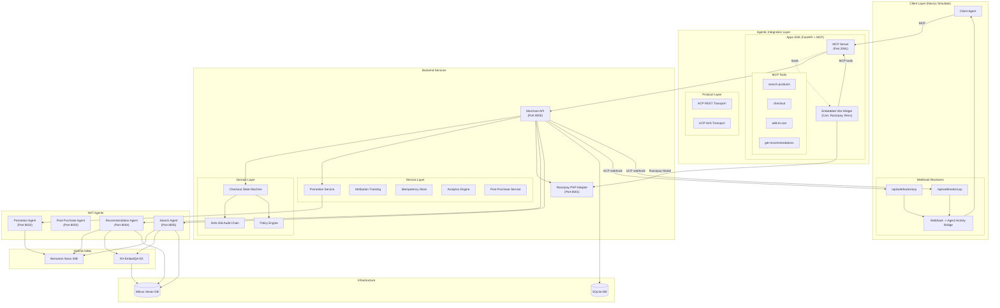

# VyapaarOS: The Unstoppable Agentic Revenue Engine

A production-grade reference implementation of the Agentic Commerce Protocol (ACP) and Universal Commerce Protocol (UCP), engineered for autonomous merchant-controlled checkouts, multi-agent orchestration, policy-gated financial actions, and end-to-end Razorpay payment integration.

Built for **Razorpay AI Buildathon - Track 01: AI Growth & Agentic Commerce**.

---

## Problem Statement

The future of commerce is not human-to-computer. It is agent-to-agent. With the emergence of NPCI's Universal Agentic Protocol (UAP) and the global protocol race (ACP, AP2, x402), merchants face a critical infrastructure gap: today's storefronts are designed for human eyeballs, not AI buyers. If an autonomous AI buyer cannot programmatically discover a catalog, negotiate a promotion, execute a checkout, and verify a payment on behalf of its user, the merchant loses the sale entirely.

Existing e-commerce platforms are passive. They wait for a human to click, scroll, and type. None of them are built to be transacted upon by an AI agent acting autonomously. This creates a massive revenue leak as the agentic economy scales.

---

## What I Built

VyapaarOS is the autonomous agentic middleware that makes any merchant instantly transactable by AI buyers, while simultaneously growing their revenue through intelligent automation. It is not a chatbot wrapper or a simple API. It is a full-stack, production-hardened commerce operating system with seven core subsystems:

### 1. Agent-Readable Discovery and Semantic Search

I built a NAT RAG Search Agent backed by Milvus Vector Database and NV-EmbedQA-E5 GPU embeddings. It matches natural-language user intent to product inventory via vector similarity search. When the heavy GPU infrastructure is unavailable (as on a local development machine without NVIDIA hardware), the system gracefully degrades to a deterministic in-process keyword search over the static product catalog. This guarantees zero-downtime discovery regardless of infrastructure state.

### 2. Autonomous Upselling and Cross-Selling with Attribution

I implemented a Recommendation Attribution Engine that tracks which AI-suggested products actually convert into purchases. Every upsell and cross-sell recommendation is attributed back to the originating agent, the request ID, and the carousel position. The system proactively injects high-conversion cross-sells during both the browse flow and the checkout flow, driving measurable AOV uplift.

### 3. Three-Layer Promotion Agent with Market Signal Analysis

I designed a rules-based Promotion Service that evaluates five real-time market signals before generating any discount: Inventory Pressure, Competition Position, Seasonal Urgency, Product Lifecycle, and Demand Velocity. Each signal is classified into severity tiers (e.g., `CRITICAL`, `HIGH`, `MODERATE`, `LOW`, `NONE`), and the resulting discount is bounded by hard caps. This prevents hallucinated 99-percent coupons while still enabling intelligent, context-aware promotions.

### 4. Fail-Safe Checkout State Machine

I implemented a formal finite state machine governing the entire checkout lifecycle: `CREATED -> READY_FOR_PAYMENT -> PROCESSING -> COMPLETED | FAILED | ABANDONED`. Every state transition is validated at the domain layer. Invalid transitions (e.g., attempting to process a payment on an already-completed session) are rejected with `InvalidPaymentTransitionError`. The system enforces fail-closed behavior on all money paths and fail-open behavior on non-critical paths like recommendations.

### 5. SHA-256 Hash-Chained Tamper-Evident Audit Trail

Every financial action in the system (discount applied, payment initiated, order confirmed, refund issued) is logged as an immutable `AuditEvent` with a SHA-256 hash chain. Each event's hash is computed from the previous event's hash plus the canonical representation of the current event's payload. The `verify_audit_chain()` function can cryptographically prove that no event was altered, reordered, or deleted after the fact. This directly satisfies the track requirement: "Every money action explainable, bounded and gated. Show the audit trail."

### 6. Policy Engine with Actor Gating

Before any financial action executes, a Policy Engine evaluates it against configurable rules:
- **Order Value Policy**: Hard caps on maximum transaction amounts with configurable thresholds.
- **Discount Policy**: Maximum discount percentage limits with automatic clamping.
- **Upsell Value Policy**: Bounds on how much additional value an upsell agent can inject.
- **Retry Policy**: Maximum payment retry attempts before terminal failure.
- **Actor Gating**: `can_actor_perform()` enforces that each agent class can only perform actions within its scope. A recommendation agent cannot initiate a refund. A promotion agent cannot override payment status.

Every policy evaluation returns a structured `PolicyDecision` with an explicit `ALLOW`, `DENY`, or `REQUIRES_APPROVAL` verdict plus a machine-readable `ReasonCode`.

### 7. Dual Protocol Support (ACP and UCP)

I implemented both the Agentic Commerce Protocol (ACP) and the Universal Commerce Protocol (UCP) as first-class protocol layers, each with:
- Dedicated checkout route handlers and session management.
- Post-purchase webhook services that generate personalized confirmation messages (with tone, language, and brand persona configuration).
- Full webhook signature verification for tamper-proof event delivery.

This makes the merchant compatible with any AI buyer protocol in the ecosystem.

---

## Additional Production Systems

### Razorpay Test-Net Integration
End-to-end payment flow using Razorpay test-mode APIs. The `RazorpayAdapter` handles order creation, payment signature verification (`razorpay_payment_id`, `razorpay_order_id`, `razorpay_signature`), and webhook signature verification. The merchant widget surfaces the native Razorpay checkout modal for secure card/UPI/netbanking payment capture.

### Post-Purchase Automation
A `PostPurchaseAgentClient` generates context-aware shipping confirmation messages after successful orders. It supports multiple tones (`PROFESSIONAL`, `CASUAL`, `FRIENDLY`, `FORMAL`), languages (`EN`, `HI`, `ES`, `FR`, `DE`), and brand personas. When the agent is unavailable, deterministic fallback templates ensure the customer always receives a confirmation.

### Idempotency Layer
An in-memory `IdempotencyStore` with configurable TTL (default 24 hours) deduplicates incoming requests using SHA-256 hashes of the request body, path, and method. This prevents double-charges and duplicate order creation across all API surfaces.

### Agent Outcome Observability
Every agent invocation (search, promotion, recommendation, post-purchase) is logged as a structured `AgentInvocationOutcome` with timestamp, agent type, channel (ACP/UCP/DIRECT), status (SUCCESS/FAILURE/TIMEOUT/FALLBACK_SUCCESS), latency in milliseconds, and error codes. The `summarize_agent_outcomes()` function aggregates these into success rates and latency percentiles for the merchant dashboard.

### Merchant Analytics Dashboard
A full metrics service computes real-time KPIs from checkout session data:
- Total Revenue, Average Order Value (AOV), and Conversion Rate with trend indicators.
- Revenue time series with configurable bucketing (hourly, daily).
- Promotion breakdown showing discount types, amounts, and frequency.
- Product health monitoring with stock status, price positioning, and attention flags.
- Agent outcome summaries with success rates per agent type.

### Recommendation Attribution Tracking
Every product recommendation that leads to a cart addition or purchase is tracked with the originating request ID, recommendation position, and source agent. The `summarize_recommendation_attribution()` function calculates click-through rates and conversion rates per recommendation slot.

### Loyalty and Tier System
The merchant widget displays user loyalty information including points balance, tier status (Gold, Silver, Platinum), and member-since date. This data is surfaced to AI agents so they can personalize recommendations and promotions based on customer lifetime value.

### Embedded Merchant Widget
A production-built React micro-frontend (Vite, single-file HTML via `vite-plugin-singlefile`) that any merchant can embed. It includes:
- Product discovery cards with images, ratings, and variant selectors.
- Full shopping cart with quantity management and real-time price calculation.
- Product detail pages with related product recommendations.
- Checkout flow with shipping address collection and Razorpay payment modal.
- Dark and light mode toggle.
- All interactions driven by MCP tool calls to the Apps SDK server.

### Revenue Experiment Framework
Synthetic A/B benchmark scripts (`run_experiment.py`, `run_experiment_local.py`) that generate 200 checkout sessions (100 baseline, 100 agent-assisted) to quantify the AOV uplift from autonomous upselling and promotion agents. These provide the "revenue growth" metrics for the pitch.

### Graceful Degradation Architecture
The system is designed for graceful degradation at every layer:
- If the NAT RAG Search Agent is unreachable, discovery falls back to in-process keyword search.
- If the Promotion Agent is unreachable, checkout proceeds without a discount (fail-open on non-critical).
- If the Post-Purchase Agent is unreachable, deterministic template messages are sent.
- If the Razorpay webhook fails, the audit trail preserves the event for manual reconciliation.
- The SQLite database engine is configured with a 15-second busy timeout to handle concurrent agent writes without "database is locked" failures.

### Comprehensive Test Suite
410 tests covering all services, tools, protocols, domain logic, and edge cases. The test suite validates graceful degradation paths, state machine transitions, policy enforcement, audit chain integrity, and idempotency guarantees.

---

## Architecture



---

## Failure Handling

The track requires "one failure handled gracefully." I handle failures at every layer:

| Failure Scenario | Behavior | Classification |
|---|---|---|
| Search Agent unreachable | Falls back to local keyword search | Fail-Open |
| Promotion Agent unreachable | Checkout proceeds without discount | Fail-Open |
| Post-Purchase Agent unreachable | Deterministic template message sent | Fail-Open |
| Invalid state transition attempted | `InvalidPaymentTransitionError` raised, transition blocked | Fail-Closed |
| Policy violation (e.g., discount > cap) | `PolicyDecision.DENY` returned, action blocked | Fail-Closed |
| Duplicate request detected | Cached response returned via idempotency store | Idempotent |
| SQLite concurrent write contention | 15-second busy timeout with automatic retry | Resilient |
| Razorpay webhook signature mismatch | Event rejected, audit event logged | Fail-Closed |

---

## Quick Start

### Prerequisites
- Python 3.12+ and `uv` package manager
- Node.js 20.9+ and `pnpm`
- Docker 24+ and Docker Compose v2 (for Milvus Vector DB; optional in lean mode)
- NVIDIA API key (for NIM agents; optional in lean mode)
- Razorpay test-mode API keys (optional, for live payment capture)

### Full Mode (with Docker and NVIDIA NIMs)
```bash
git clone <repo-url>
cd Retail-Agentic-Commerce
cp env.example .env
# Edit .env with API keys
docker compose -f docker-compose.infra.yml up -d
./install.sh
```

### Lean Mode (local Mac, no Docker, no GPU)
```bash
./start-lean.sh
```
This starts only the Merchant API (port 8000), Payment Service (port 8001), Apps SDK MCP Server (port 2091), and Next.js UI (port 3000). All agent-dependent features gracefully degrade to local fallbacks.

### Access Points
- Demo UI: http://localhost:3000
- Merchant API docs: http://localhost:8000/docs
- Apps SDK MCP docs: http://localhost:2091/docs

---

## Project Structure

```text
src/
  ui/                              Next.js 14 Simulator UI (port 3000)
  apps_sdk/                        FastAPI MCP Server (port 2091)
    web/                           Vite React Widget (single-file micro-frontend)
    tools/                         MCP Tool handlers (search, cart, checkout, recommendations)
    main.py                        MCP server entry point and tool registry
  merchant/                        Core Merchant REST API (port 8000)
    domain/
      payments/
        state_machine.py           Formal checkout state machine
        audit.py                   SHA-256 hash-chained audit trail
        policy.py                  Policy engine with actor gating
      checkout/
        service.py                 Checkout orchestration service
    services/
      promotion.py                 3-layer promotion agent with 5 market signals
      post_purchase.py             Post-purchase message generation
      recommendation_attribution.py  Recommendation conversion tracking
      agent_outcomes.py            Agent invocation observability
      idempotency.py               Request deduplication store
      metrics.py                   Merchant analytics dashboard
      payment_adapter.py           Razorpay API adapter
    protocols/
      acp/                         Agentic Commerce Protocol implementation
      ucp/                         Universal Commerce Protocol implementation
    db/
      models.py                    SQLModel database schemas
      database.py                  SQLite engine configuration
  payment/                         PSP Integration Service (port 8001)
  agents/                          NAT Agents (Search, Promotion, Recommendation, Post-Purchase)
  data/
    product_catalog.py             Static product catalog for local fallback search

tests/                             410 tests across all subsystems
  apps_sdk/                        MCP tool and recommendation tests
  merchant/                        Domain, service, and protocol tests
  payment/                         Payment adapter tests
```

---

## Codebase Statistics

| Metric | Value |
|---|---|
| Python source lines | ~20,000 |
| TypeScript/TSX source lines | ~14,000 |
| Test lines | ~9,600 |
| Total tests passing | 410/410 |
| Backend services | 4 (Merchant, PSP, Apps SDK, UI) |
| NAT Agents | 4 (Search, Promotion, Recommendation, Post-Purchase) |
| MCP Tools | 4 (search-products, add-to-cart, checkout, get-recommendations) |
| Protocols implemented | 2 (ACP, UCP) |

---

## Documentation

- [Architecture Deep Dive](docs/architecture.md)
- [ACP Specification](docs/specs/acp-spec.md)
- [UCP Specification](docs/specs/ucp-spec.md)
- [Apps SDK Specification](docs/specs/apps-sdk-spec.md)
- [Agent Integration Guide](src/agents/README.md)
- [Docker Deployment](deploy/docker-deployment.md)
- [Local Development](deploy/local-development.md)

---

## License

This project is built on top of the NVIDIA AI Blueprint for Retail Agentic Commerce. See [LICENSE](LICENSE) for details.
